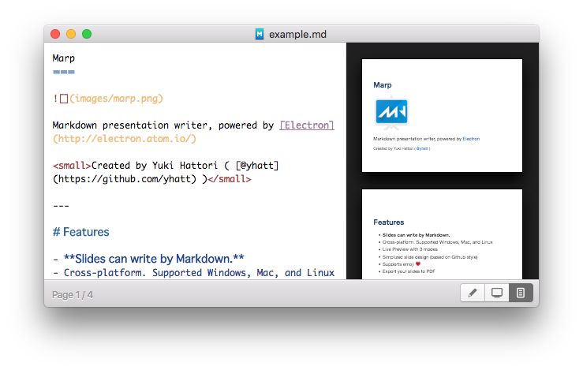

Marp
===

**Markdown presentation writer, powered by [Electron](http://electron.atom.io/).**

---

### :warning: **This repository is pre-release version, and we have already dropped maintenance.** We are planning the future of Marp at [**@marp-team/marp**](https://github.com/marp-team/marp).

See more details in [yhatt/marp#267](https://github.com/yhatt/marp/issues/267).

> We will archive this repository when a future Marp has grown to replace a pre-release version.

<!--

---



## Usage

### Install

:arrow_forward: **[Download latest archives from release page.](https://github.com/yhatt/marp/releases)**

- **Windows**: Unzip `*.*.*-Marp-win32-[arch].zip` and run `Marp.exe`.
- **macOS**: Mount `*.*.*-Marp-darwin-x64.dmg`, D&D `Marp` to `Applications` and run it from Applications folder / Launchpad. Or use [Homebrew](http://brew.sh) [Cask](https://caskroom.github.io): `brew cask install marp`
- **Linux**: Unpack `*.*.*-Marp-linux-[arch].tar.gz` and run `Marp`.

### How to write slides?

Split slides by horizontal ruler `---`. It's very simple. Please refer to [example.md](https://raw.githubusercontent.com/yhatt/marp/master/example.md).

```md
# Slide 1

foobar

---

# Slide 2

foobar
```

## For developers

### Getting started

```
yarn install
yarn start
```

### Customizing Slide CSS

It's easy, include a `<link>` tag at the top of your presentation, or alternatively a `<style>` tag that contains all of your styles. All CSS should be targeting either `.slide` or elements inside of `.slide`. For reference, check out the gaia theme in the sass folder.

### Create release builds

```
yarn gulp release
```

Please set application version in `package.json`.

#### OS specific

##### Windows

If you want to build for Windows in other platforms, please install [Wine](https://www.winehq.org/) to rewrite Electron's resources.

##### macOS

To build for Darwin is only supported in macOS.

-->

## Licenses

Copyright &copy; 2016-2018 [Yuki Hattori](https://github.com/yhatt).

This software released under the [MIT License](https://github.com/yhatt/marp/blob/master/LICENSE).
